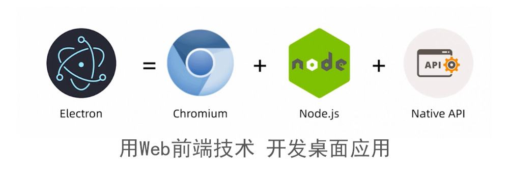

# 【Electron】开发环境搭建


## Electron 是什么

[Electron](https://www.electronjs.org/) 是由 Github 开发的框架，基于 Chromium 和 Node.js，让你可以使用 HTML, CSS 和 JavaScript 构建跨平台的桌面应用程序并且可以用于商用。




## 前提条件

在使用 Electron 之前，需要安装 [Node.js](https://nodejs.org/en/download/)。 建议安装最新可用的 `LTS` 或 `Current 版本` 。

要检查 Node.js 是否正确安装，请在您的终端输入以下命令：

```
node -v
npm -v
```
这两个命令应输出了 Node.js 和 npm 的版本信息。如果这两个命令都执行成功，你就可以开始准备安装 Electron了。

## 创建基本应用程序

从开发的角度来看，Electron 应用本质上就是一个 Node.js 应用。 这意味着您的 Electron 应用程序的起点将是一个 `package.json` 文件，就像在其他的 Node.js 应用程序中一样。最小的 Electron 应用程序具有以下结构：

```
my-electron-app/
├── package.json
├── main.js
└── index.html
```

### 安装 Electron

为您的项目创建一个文件夹并安装 Electron：

```
mkdir my-electron-app && cd my-electron-app
npm init -y
npm i --save-dev electron
```
可以使用 `npx electron -v` 命令查看 Electron 是否安装成功。


## 参考资料

[Electron 文档](https://www.electronjs.org/docs/tutorial/quick-start#%E5%BF%AB%E9%80%9F%E5%85%A5%E9%97%A8)

[Electron 免费视频教程-用前端技术开发桌面应用](http://jspang.com/detailed?id=62)
