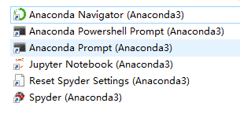

# Anaconda

我也是一个刚开始学 Python 的一个小伙，不小心让我搜索到了 Anaconda。我使用的是 [Anaconda 个人版](https://docs.anaconda.com/anaconda/)，版本是 Anaconda3-2020.11。

Anaconda 是一个程序包管理器，一个环境管理器，一个 Python/R 数据科学发行版以及 [超过7500多个开源程序包](https://docs.anaconda.com/anaconda/packages/pkg-docs/) 的集合。这句话是来自官网的介绍，从这句话中可以了解到 Anaconda 主要针对 Python 或 R 语言，而且定位是数据科学。对于环境管理器，你可以认为它类似容器和虚拟机，不同的环境可以运行不同的 Python 版本和程序。

下图是 Anaconda 安装完成后，显示的快捷方式：

我也是刚学，对于倒数第三个就不知道是干啥的了，先说说前三个。

Anaconda Navigator (Anaconda3) 这是一个 GUI 图形化界面，主要是为了我这样不喜欢命令行的人准备的。

Anaconda Powershell Prompt (Anaconda3) 和 Anaconda Prompt (Anaconda3) 都是终端工具，有啥不一样就不说了。

Spyder (Anaconda3) 就是一个 IDE。

> 值得注意的是：Anaconda Navigator 和 Anaconda 并不一样，不要搞混了 Anaconda Navigator 就是一个 GUI 界面。而 Anaconda 包含了 程序包管理器 和 环境管理器。

## 参看资料

[Anaconda Individual Edition](https://docs.anaconda.com/anaconda/)

[Installing on Windows](https://docs.anaconda.com/anaconda/install/windows/)

[Conda](https://conda.io/en/latest/)

[Conda](https://docs.conda.io/projects/conda/en/latest/index.html)

