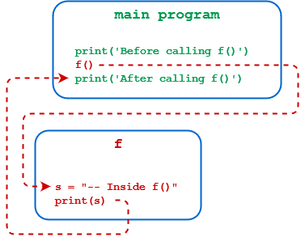

# 定义自己的 Python 函数

定义 Python 函数的常用语法如下：

```python
def <function_name>([<parameters>]):
    <statement(s)>
```

| 组成 | 说明 |
|:----|:----|
|def|表示要定义一个函数。|
|<function_name>|函数名称。|
|<parameters>|可选的，用逗号分隔的参数列表，可以将其传递给函数。|
|:|标点符号，表示 Python 函数的结尾（名称和参数列表）|
|<statement(s)>|有效的Python语句块|

下面是一个例子：

```python
def f():
    s = '-- Inside f()'
    print(s)

print('Before calling f()')
f()
print('After calling f()')
```

下图展示了执行顺序：




## 位置参数

将参数传递给函数，最直接的方法就是使用位置参数，也称为必需参数。

假设定义了下面这个函数，参数(qty,  item and price) 的行为类似于在函数本地定义的变量。

```python
>>> def f(qty, item, price):
...     print(f'{qty} {item} cost ${price:.2f}')
...
```

调用该函数时，传递的参数(6，“ bananas” 和 1.74) 按顺序绑定到参数，就像变量赋值一样。

```python
>>> f(6, 'bananas', 1.74)
6 bananas cost $1.74
```


下面是两个有异常的函数调用示例：

```python
>>> # Too few arguments
>>> f(6, 'bananas')
Traceback (most recent call last):
  File "<pyshell#6>", line 1, in <module>
    f(6, 'bananas')
TypeError: f() missing 1 required positional argument: 'price'
        
>>> # Too many arguments
>>> f(6, 'bananas', 1.74, 'kumquats')
Traceback (most recent call last):
  File "<pyshell#5>", line 1, in <module>
    f(6, 'bananas', 1.74, 'kumquats')
TypeError: f() takes 3 positional arguments but 4 were given
```


## 关键字参数

调用函数时，可以以 `<keyword> = <value>` 形式指定参数。在这种情况下，每个 `<keyword>` 必须与 Python 函数定义中的一个参数的名字匹配。

```python
>>> f(qty=6, item='bananas', price=1.74)
6 bananas cost $1.74
```

使用一个没有的参数名，会出现异常：

```python
>>> f(qty=6, item='bananas', cost=1.74)
Traceback (most recent call last):
  File "<stdin>", line 1, in <module>
TypeError: f() got an unexpected keyword argument 'cost'
```

使用关键字参数可以**解除对参数顺序的限制**：

```python
>>> f(item='bananas', price=1.74, qty=6)
6 bananas cost $1.74
```

可以同时使用位置参数和关键字参数来调用函数，当位置参数和关键字参数同时存在时，所有位置参数必须排在最前面。

```python
>>> f(6, price=1.74, item='bananas')
6 bananas cost $1.74

>>> f(6, 'bananas', price=1.74)
6 bananas cost $1.74
```


## 默认值参数
如果 Python 函数定义中指定的参数格式为 `<name> = <value>`，则 `<value>` 成为该参数的默认值。 以这种方式定义的参数称为默认或可选参数。

带有默认参数的函数定义示例如下所示：

```python
>>> def f(qty=6, item='bananas', price=1.74):
...     print(f'{qty} {item} cost ${price:.2f}')
...
```

调用此版本的 `f()` 时，任何遗漏的参数均采用其默认值：

```python
>>> f(4, 'apples', 2.24)
4 apples cost $2.24
>>> f(4, 'apples')
4 apples cost $1.74

>>> f(4)
4 bananas cost $1.74
>>> f()
6 bananas cost $1.74

>>> f(item='kumquats', qty=9)
9 kumquats cost $1.74
>>> f(price=2.29)
6 bananas cost $2.29
```


**总而言之：**

* **位置参数** 必须在顺序和数量上与函数定义中声明的形参一致。

* **关键字参数** 必须与声明的参数数量一致，但它们可以以任意顺序。

* **默认参数** 允许在调用函数时省略一些实参。


## 可变的默认参数值

如果指定默认参数值是**可变对象**，事情就会变得很奇怪。考虑这个 Python 函数定义：

```python
>>> def f(my_list=[]):
...     my_list.append('###')
...     return my_list
...
```

`f()` 采用单个 `list` 参数，将字符串 `'###'` 追加到列表末尾，并返回结果：

```python
>>> f(['foo', 'bar', 'baz'])
['foo', 'bar', 'baz', '###']

>>> f([1, 2, 3, 4, 5])
[1, 2, 3, 4, 5, '###']
```

参数 `my_list` 的默认值为空列表，因此如果调用 `f()` 时不带任何参数，则返回值为包含单个元素 `'###'` 的列表：

```python
>>> f()
['###']
```

到目前为止，一切都没有问题。现在，如果第二次和第三次不带任何参数调用 `f()` 会发生什么？让我们来看看：

```python
>>> f()
['###', '###']
>>> f()
['###', '###', '###']
```

很有意思的事情发送了，为什么返回值会不断地增加呢？

这是因为在 Python 中，默认形参值只在定义函数时定义一次(即在执行 `def` 语句时)，默认值不会在每次调用函数时重新定义。因此，每次不带参数地调用 `f()` 时，都是在同一个列表上执行 `.append()`。

可以使用 `id()` 来演示这一点：

```python
>>> def f(my_list=[]):
...     print(id(my_list))
...     my_list.append('###')
...     return my_list
...
>>> f()
140095566958408
['###']        
>>> f()
140095566958408
['###', '###']
>>> f()
140095566958408
['###', '###', '###']
```

都是调用相同的 `my_list` 对象，所以列表中的值会递增。可以修改为 `my_list=None` 来决绝这个问题：

```python
>>> def f(my_list=None):
...     if my_list is None:
...         my_list = []
...         my_list.append('###')
...     return my_list
...

>>> f()
['###']
>>> f()
['###']
>>> f()
['###']

>>> f(['foo', 'bar', 'baz'])
['foo', 'bar', 'baz', '###']

>>> f([1, 2, 3, 4, 5])
[1, 2, 3, 4, 5, '###']
```


## 返回值

在函数中，`return` 语句会导致立即退出 Python 函数并将执行转移回调用方。

```python
>>> def f(x):
...     if x < 0:
...         return
...     if x > 100:
...         return
...     print(x)
...

>>> f(-3)
>>> f(105)
>>> f(64)
64
```

当没有给出返回值时，Python 中的函数将返回 `None`。

```python
>>> def f():
...     return
...

>>> print(f())
None

>>> def g():
...     pass
...

>>> print(g())
None
```

返回值 `None` 可以在 `Boolean` 上下文中使用：

```python
>>> def f():
...     return
...
>>> def g():
...     pass
...

>>> if f() or g():
...     print('yes')
... else:
...     print('no')
...
no
```


## 将实参打包为元组(tuple)

在 Python 中定义函数时，将参数名前面加上星号(*)，当函数调用时传递的实参都会打包成一个元组，函数可以通过给定的形参名称引用该元组。

```python
>>> def f(*args):
...     print(args)
...     print(type(args), len(args))
...     for x in args:
...             print(x)
...

>>> f(1, 2, 3)
(1, 2, 3)        
<class 'tuple'> 3
1
2
3

>>> f('foo', 'bar', 'baz', 'qux', 'quux')
('foo', 'bar', 'baz', 'qux', 'quux')
<class 'tuple'> 5
foo
bar
baz
qux
quux
```


### 将元组拆包

当函数调用中的参数前面带有星号（*）时，表示该参数是一个元组，应将其拆包并作为单独的值传递给函数。

```python
>>> def f(x, y, z):
...     print(f'x = {x}')
...     print(f'y = {y}')
...     print(f'z = {z}')
...

>>> f(1, 2, 3)
x = 1
y = 2
z = 3

>>> t = ('foo', 'bar', 'baz')
>>> f(*t)
x = foo
y = bar
z = baz
```

在这个例子中，调用函数时的参数为 `*t`，表示 `t` 是一个应该解包的元组。然后将解包后的值 'foo'、'bar' 和 'baz' 分别赋给参数 `x`、`y` 和 `z`。

> 值得注意的是：不仅只有元组可以拆包，只要是可以迭代的对象都可以拆包。例如：`list` 和 `set`。


## 将实参打包为字典(dict)

和打包元组类似，使用双星号(**) 打包字典。

```python
>>> def f(**kwargs):
...     print(kwargs)
...     print(type(kwargs))
...     for key, val in kwargs.items():
...             print(key, '->', val)
...

>>> f(foo=1, bar=2, baz=3)
{'foo': 1, 'bar': 2, 'baz': 3}
<class 'dict'>
foo -> 1
bar -> 2
baz -> 3
```

虽然这种传参方式和前面说的**关键字参数**一样，但是没有必要进行一些显示处理或注释。因为熟练使用 Python 的都知道。


### 将元组拆包

参数字典拆包类似于参数元组拆包。

```python
>>> def f(a, b, c):
...     print(F'a = {a}')
...     print(F'b = {b}')
...     print(F'c = {c}')
...

>>> d = {'a': 'foo', 'b': 25, 'c': 'qux'}
>>> f(**d)
a = foo
b = 25
c = qux
```


## 混合使用

可以将 `*args` 当作可变长度的**位置参数**列表，而将 `**kwargs` 视为可变长度的**关键字参数**列表。

混合使用时，必须按照下面这个顺序：

```python
>>> def f(a, b, *args, **kwargs):
...     print(F'a = {a}')
...     print(F'b = {b}')
...     print(F'args = {args}')
...     print(F'kwargs = {kwargs}')
...

>>> f(1, 2, 'foo', 'bar', 'baz', 'qux', x=100, y=200, z=300)
a = 1
b = 2
args = ('foo', 'bar', 'baz', 'qux')
kwargs = {'x': 100, 'y': 200, 'z': 300}
```


## 只用关键字参数

假设您想编写一个 Python 函数，该函数接受可变数量的字符串参数，将它们连接在一起，并用点(".") 分隔，然后将它们打印到控制台。 

```python
>>> def concat(*args):
...     print(f'-> {".".join(args)}')
...

>>> concat('a', 'b', 'c')
-> a.b.c
>>> concat('foo', 'bar', 'baz', 'qux')
-> foo.bar.baz.qux
```

如果你想修改前缀("->") 则可以将函数修改成以下的样子：

```python
>>> def concat(prefix, *args):
...     print(f'{prefix}{".".join(args)}')
...

>>> concat('//', 'a', 'b', 'c')
//a.b.c
>>> concat('... ', 'foo', 'bar', 'baz', 'qux')
... foo.bar.baz.qux
```

但是这样做有两个问题：

* 可能并不知道 `//` 和 `...` 表示前缀，需要到函数中查看具体实现。
* `prefix` 不是可选的。

如果你简单的认为，写成下面这个样子就能解决上面的第二个问题，你就错了。

```python
>>> def concat(prefix='-> ', *args):
...     print(f'{prefix}{".".join(args)}')
...
```

下面是执行结果：

```python
>>> concat('a', 'b', 'c')
ab.c

>>> concat(prefix='//', 'a', 'b', 'c')
  File "<stdin>", line 1
SyntaxError: positional argument follows keyword argument
    
>>> concat('a', 'b', 'c', prefix='... ')
Traceback (most recent call last):
  File "<stdin>", line 1, in <module>
TypeError: concat() got multiple values for argument 'prefix'
```

第一个执行结果，将 `a` 当成了 `prefix`。

第二个执行结果，当同时给出两种类型的参数时，所有**位置参数**必须位于任何**关键字参数**之前。

第三个执行结果，虽然将**关键字参数**放到了后面，但是还是出错了，这是因为 `prefix` 是一个位置参数，因此为它分配了调用中指定的第一个参数(本例中为"a") 然后，当最后再次将其指定为**关键字参数**时，Python认 为它被赋值了两次。


所以正确的写法是下面这个样子：

```python
>>> def concat(*args, prefix='-> ', sep='.'):
...     print(f'{prefix}{sep.join(args)}')
...

>>> concat('a', 'b', 'c')
-> a.b.c
>>> concat('a', 'b', 'c', prefix='//')
//a.b.c
>>> concat('a', 'b', 'c', prefix='//', sep='-')
//a-b-c
```


## 只用位置参数

从 Python 3.8 开始，函数参数也可以声明为仅位置，这意味着相应的参数必须在位置上提供，并且不能由关键字指定。

想要将某些参数指定为位置参数，可以在函数定义的参数列表中指定斜杠(/)。也就是说在斜杠(/) 左侧的任何参数都是位置参数。

例如，在以下函数定义中，`x` 和 `y` 是位置参数，但是 `z` 可以由关键字指定：

```python
>>> # This is Python 3.8
>>> def f(x, y, /, z):
...     print(f'x: {x}')
...     print(f'y: {y}')
...     print(f'z: {z}')
...
```

下面是正确的调用：

```python
>>> f(1, 2, 3)
x: 1
y: 2
z: 3

>>> f(1, 2, z=3)
x: 1
y: 2
z: 3
```

下面是错误调用：

```python
>>> f(x=1, y=2, z=3)
Traceback (most recent call last):
  File "<stdin>", line 1, in <module>
TypeError: f() got some positional-only arguments passed as keyword arguments:
'x, y'
```

下面演示了一个关键字和位置参数的混合使用：

```python
>>> # This is Python 3.8
>>> def f(x, y, /, z, w, *, a, b):
...     print(x, y, z, w, a, b)
...

>>> f(1, 2, z=3, w=4, a=5, b=6)
1 2 3 4 5 6

>>> f(1, 2, 3, w=4, a=5, b=6)
1 2 3 4 5 6
```

我感觉参数中添加 `/` 或 `*` 意义不是很大。


## 函数注释

最简单的一个注释：

```python
>>> def foo(bar=0, baz=1):
...     """Perform a foo transformation.
...
...     Keyword arguments:
...     bar -- magnitude along the bar axis (default=0)
...     baz -- magnitude along the baz axis (default=1)
...     """
...     <function_body>
...
```

打印注释内容：

```python
>>> print(foo.__doc__)
Perform a foo transformation.

    Keyword arguments:
    bar -- magnitude along the bar axis (default=0)
    baz -- magnitude along the baz axis (default=1)
```


从 python 3.0 开始增加了**功能注释**，下面是基础语法，另外功能注释的信息都会保存在 `__annotations__` 中：

```python
>>> def f(a: '<a>', b: '<b>') -> '<ret_value>':
...     pass
...
```

下面是一个演示案例：

```python
>>> def f(a: int, b: str) -> float:
...     print(a, b)
...     return(3.5)
...

>>> f(1, 'foo')
1 foo
3.5

>>> f.__annotations__
{'a': <class 'int'>, 'b': <class 'str'>, 'return': <class 'float'>}
```

当然也可以使用 `list` 或 `dictionary`：

```python
>>> def area(
...     r: {
...            'desc': 'radius of circle',
...            'type': float
...        }) -> \
...        {
...            'desc': 'area of circle',
...            'type': float
...        }:
...     return 3.14159 * (r ** 2)
...

>>> area(2.5)
19.6349375

>>> area.__annotations__
{'r': {'desc': 'radius of circle', 'type': <class 'float'>},
'return': {'desc': 'area of circle', 'type': <class 'float'>}}

>>> area.__annotations__['r']['desc']
'radius of circle'
>>> area.__annotations__['return']['type']
<class 'float'>
```


## 参考资料

[Defining Your Own Python Function](https://realpython.com/defining-your-own-python-function/)

