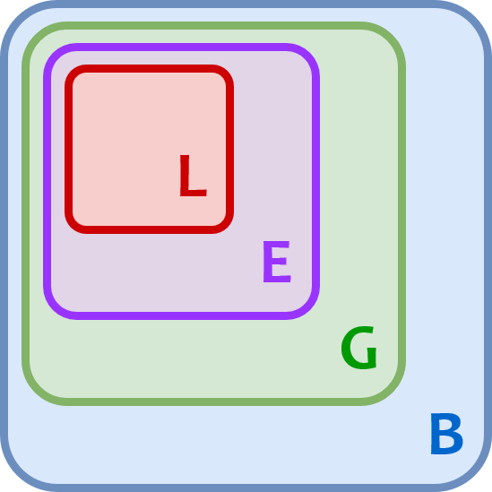
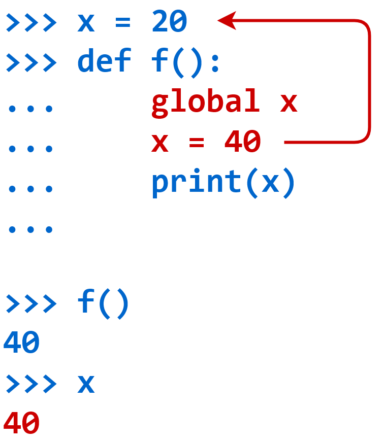
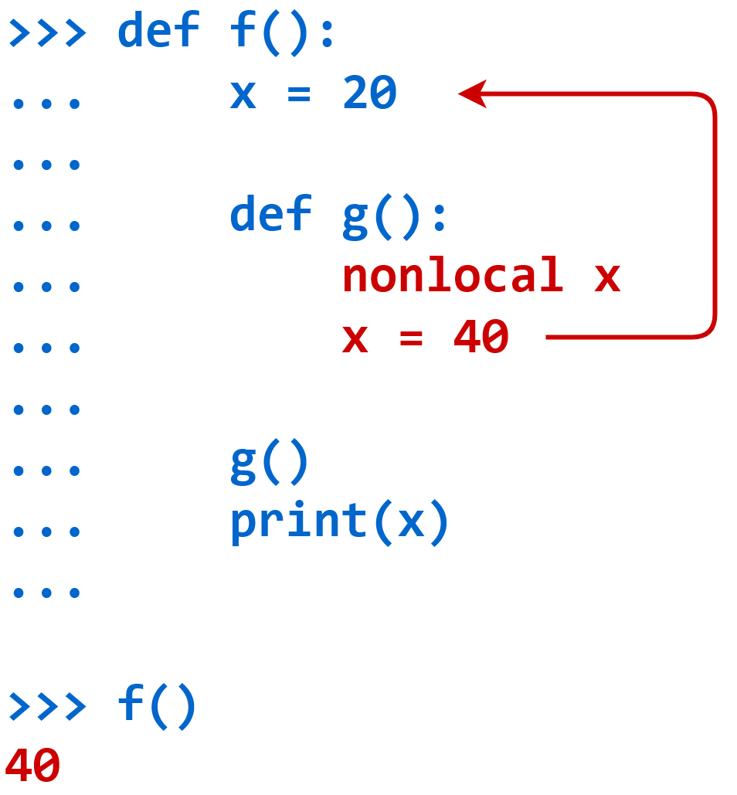

# 范围(Scope) 和 命名空间(Namespaces)

Python 中的命名空间一般都是使用字典实现的，但是有一些命名空间使用的是序列。

这是因为 Python 中的命名空间一共有三种：内置(built-in)、全局(global)、本地(local)。

**内置命名空间**是 Python 解释器在启动时直接创建的，并且这个命名空间一直存在，直到解释器终止。该命名空间中保存了 Python 内置的对象名(例如 BaseException)、方法名(例如 dir)、常量(例如 False)。

```python
>>> dir(__builtins__)
['ArithmeticError', 'AssertionError', 'AttributeError', 'BaseException', 'BlockingIOError', 'BrokenPipeError', 'BufferError', 'BytesWarning', 'ChildProcessError', 'ConnectionAbortedError', 'ConnectionError', 'ConnectionRefusedError', 'ConnectionResetError', 'DeprecationWarning', 'EOFError', 'Ellipsis', 'EnvironmentError', 'Exception', 'False', 'FileExistsError', 'FileNotFoundError', 'FloatingPointError', 'FutureWarning', 'GeneratorExit', 'IOError', 'ImportError', 'ImportWarning', 'IndentationError', 'IndexError', 'InterruptedError', 'IsADirectoryError', 'KeyError', 'KeyboardInterrupt', 'LookupError', 'MemoryError', 'ModuleNotFoundError', 'NameError', 'None', 'NotADirectoryError', 'NotImplemented', 'NotImplementedError', 'OSError', 'OverflowError', 'PendingDeprecationWarning', 'PermissionError', 'ProcessLookupError', 'RecursionError', 'ReferenceError', 'ResourceWarning', 'RuntimeError', 'RuntimeWarning', 'StopAsyncIteration', 'StopIteration', 'SyntaxError', 'SyntaxWarning', 'SystemError', 'SystemExit', 'TabError', 'TimeoutError', 'True', 'TypeError', 'UnboundLocalError', 'UnicodeDecodeError', 'UnicodeEncodeError', 'UnicodeError', 'UnicodeTranslateError', 'UnicodeWarning', 'UserWarning', 'ValueError', 'Warning', 'WindowsError', 'ZeroDivisionError', '__build_class__', '__debug__', '__doc__', '__import__', '__loader__', '__name__', '__package__', '__spec__', 'abs', 'all', 'any', 'ascii', 'bin', 'bool', 'breakpoint', 'bytearray', 'bytes', 'callable', 'chr', 'classmethod', 'compile', 'complex', 'copyright', 'credits', 'delattr', 'dict', 'dir', 'divmod', 'enumerate', 'eval', 'exec', 'exit', 'filter', 'float', 'format', 'frozenset', 'getattr', 'globals', 'hasattr', 'hash', 'help', 'hex', 'id', 'input', 'int', 'isinstance', 'issubclass', 'iter', 'len', 'license', 'list', 'locals', 'map', 'max', 'memoryview', 'min', 'next', 'object', 'oct', 'open', 'ord', 'pow', 'print', 'property', 'quit', 'range', 'repr', 'reversed', 'round', 'set', 'setattr', 'slice', 'sorted', 'staticmethod', 'str', 'sum', 'super', 'tuple', 'type', 'vars', 'zip']
```


**全局命名空间** 和 **内置命名空间** 类似，都是直到解释器终止才销毁。

不同的是全局命名空间，是在主程序启动的时创建，并且会使用**字典**来保存模块中的数据。在 Python 中一个模块就是一个 `.py` 格式的文件，文件名就是模块名。

```python
>>> import sys
>>> x = 10
>>> def test1():
	pass

>>> globals()
{'__name__': '__main__', '__doc__': None, '__package__': None, '__loader__': <class '_frozen_importlib.BuiltinImporter'>, '__spec__': None, '__annotations__': {}, '__builtins__': <module 'builtins' (built-in)>, 'sys': <module 'sys' (built-in)>, 'x': 10, 'test1': <function test1 at 0x00000200BA5080D0>}
```

保存的模块数据有：模块的路径和名称、模块中的变量名、函数、类和其它导入的模块。

> 值得注意的是：全局命名空间并不是唯一的命名空间，因为使用 `import` 加载模块的时候，解释器会为这个模块创建新的全局命名空间。
>


每当函数执行时，解释器都会创建一个新的命名空间，该命名空间是函数的**本地命名空间**，并一直存在，直到函数终止。

**本地命名空间** 中保存了函数的参数和局部定义的变量。

```python
>>> def test1(s):
    x = 100
    print(locals())

    
>>> test1(20)
{'s': 20, 'x': 100}
```

如果你在某个函数中又定义了一个或多个**封闭函数**：

```python
>>> def test1(s):
    x = 100

    def n1():
        pass

    def n2(s):
        x = 200
        print(locals())

    n2(30)

    print(locals())

    
>>> test1(10)
{'s': 30, 'x': 200}
{'s': 10, 'x': 100, 'n1': <function test1.<locals>.n1 at 0x000001356C7D3CA0>, 'n2': <function test1.<locals>.n2 at 0x000001356C7D3D30>}
```

`n1()` 和  `n2()` 都会创建属于自己的命名空间，只不过这两个命名空间叫做**封闭命名空间**。

这些命名空间一直存在，直到它们各自的函数终止。当这些命名空间的函数终止时，Python 可能不会立即回收为这些命名空间分配的内存，但是它们包含对象的所有引用都不再有效。


> 除非你要关心应用程序的性能，否则不会用到命名空间。


## 范围(Scope)

肯定会存在多个命名空间，运行 Python 程序时允许一个特定名称的多个不同实例可以同时存在(就像上面的**封闭命名空间**中也存在 `x` 和 `s` 一样)，只要每个实例位于不同的命名空间中，它们都将单独维护并且不会互相干扰。


但这引发了一个问题：假设在代码中引用了名称 `x`，并且 `x` 存在于多个命名空间中，怎么能让 Python 用哪个呢？

答案在于范围的概念。解释器在运行时，会根据名称的定义或被引用的位置来确定使用哪个函数或变量。

如果你的代码指向名称 `x`，那么 Python 会按照以下顺序在以下命名空间中搜索 `x`：

1. Local：如果在函数内部引用 `x`，则解释器会首先在该函数的本地命名空间中搜索。

2. Enclosing：如果 `x` 不在本地范围内，但出现在当前函数内部的函数中，则解释器会在封闭命名空间中搜索。

3. Global：如果上面都没有搜索到，则解释器将在全局命名空间中搜索。

4. Built-in：如果在其他任何地方都找不到 `x`，则解释器会尝试在内置命名空间中搜索。





上面是让我们知道了怎么引用 `x`，下面再说说怎么修改 `x`。


### 使用 global 声明

如果确实需要从 `f()` 中修改全局作用域中的值，可以使用 `global` 关键字。

```python
>>> x = 20
>>> def f():
...     global x
...     x = 40
...     print(x)
...

>>> f()
40
>>> x
40
```

`global x` 语句表明，当 `f()` 执行时，对名字 `x` 的引用将引用全局命名空间中的 `x`。这意味着赋值 `x = 40` 不会创建一个新的引用，而是为全局范围中的 `x` 分配一个新值。



如果不想使用 `global` 关键字，你可以用 `globals()` 来完成同样的事情。

```python
>>> x = 20
>>> def f():
...     globals()['x'] = 40
...     print(x)
...

>>> f()
40
>>> x
40
```

如果在函数启动时，`global` 声明中指定的名称在全局作用域中不存在，那么 `global` 语句和赋值的组合将创建它。

```python
>>> y
Traceback (most recent call last):
  File "<pyshell#79>", line 1, in <module>
    y
NameError: name 'y' is not defined

>>> def g():
...     global y
...     y = 20
...

>>> g()
>>> y
20
```


### 使用 nonlocal 声明

要在 `g()` 内部的封闭作用域中修改 `x`，需要使用关键字 `nonlocal`。在 `nonlocal` 关键字后面指定的名称指向最近的封闭作用域中的变量：

```python
>>> def f():
...     x = 20
...
...     def g():
...         nonlocal x
...         x = 40
...
...     g()
...     print(x)
...

>>> f()
40
```

在第 5 行非局部 `x` 语句之后，当 `g()` 指向 `x` 时，它指向最近的封闭作用域中的 `x`，其定义在第 2 行 `f()` 中：



第 9 行 `f()` 末尾的 `print()` 语句确认对 `g()` 的调用已经将封闭作用域中的 `x` 值更改为 40。


## 参考资料

[Namespaces and Scope in Python](https://realpython.com/python-namespaces-scope/)