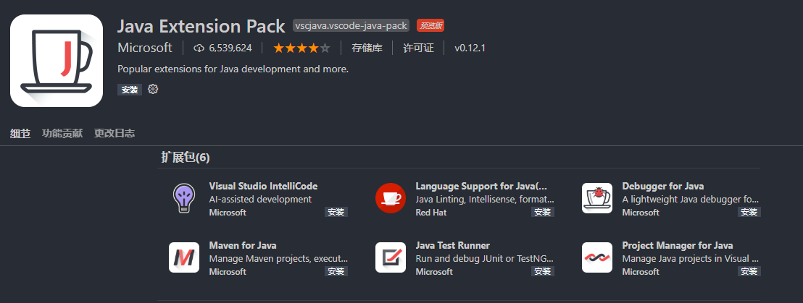
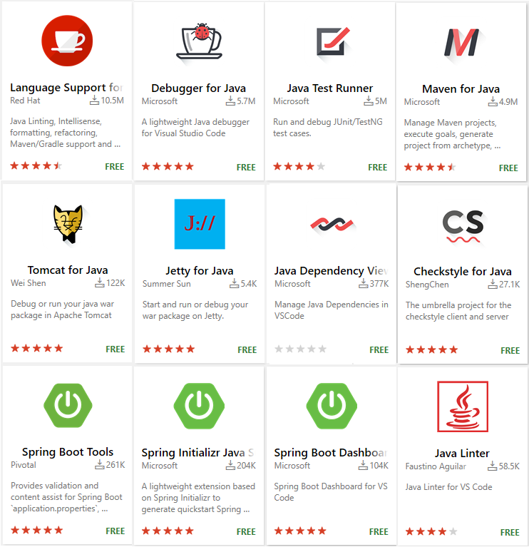
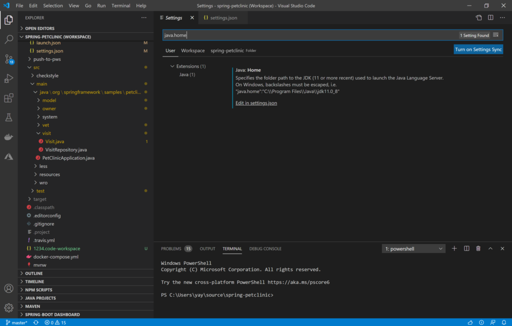

# VSCode 搭建 Java 开发环境

如果你不想自己看下面无聊的配置教程，想直接使用则可以下载 Coding Pack，但它并没有 Linux 版本。


## Java Extension Pack

使用 Java Extension Pack 这个工具是为了在 VS Code 上配置 Java，这款工具包含了：

1. [Language Support for Java(TM) by Red Hat](https://marketplace.visualstudio.com/items?itemName=redhat.java)
2. [Debugger for Java](https://marketplace.visualstudio.com/items?itemName=vscjava.vscode-java-debug)
3. [Java Test Runner](https://marketplace.visualstudio.com/items?itemName=vscjava.vscode-java-test)
4. [Maven for Java](https://marketplace.visualstudio.com/items?itemName=vscjava.vscode-maven)
5. [Project Manager for Java](https://marketplace.visualstudio.com/items?itemName=vscjava.vscode-java-dependency)
6. [Visual Studio IntelliCode](https://marketplace.visualstudio.com/items?itemName=VisualStudioExptTeam.vscodeintellicode)



可以通过 [Java Extension Pack](https://marketplace.visualstudio.com/items?itemName=vscjava.vscode-java-pack) 页面来安装，也可以通过 `Ctrl+Shift+X` 进行安装。

当然除了上面这些扩展工具以外，你还可以安装下面这些工具：



> 当然类似于  Java Extension Pack 的有很多，可以根据选择自己去安装或者构建。


## 配置 JDK

通过快捷键 `Ctrl+Shift+P`，打开命令面板并输入 `java:Configure Java Runtime` 来下载你的目标 openJDK。

由于我的电脑上已经存在了 AdoptOpenJDK8(Hotspot) 所以需要手动在 `settings.json` 文件中配置：

```json
"java.home": "D:\\allData\\developTool_doc\\adopt-openjdk\\jdk-11.0.9.1+1",
"java.configuration.runtimes": [
    {
        "name": "JavaSE-1.8",
        "path": "D:\\allData\\developTool_doc\\adopt-openjdk\\jdk8u275-b01",
        "sources" : "D:\\allData\\developTool_doc\\adopt-openjdk\\jdk8u275-b01\\src.zip",
        "javadoc" : "https://docs.oracle.com/en/java/javase/11/docs/api",
        "default":  true
    }
]
```

可以通过 File>Preferences>Settings 菜单，然后搜索配置项 “java.home”，打开 `settings.json` 文件。



> 注意：`java.home` 配置的是 JDK11 版本，用于启动 Java 语言服务器。这个语言服务器可以理解成，用来编译和运行项目的。


由于我写这篇文章的时间是 2021年1月22日，所以最低要求是 JDK11 了。

我参考 [Vscode中不再支持JDK8的解决方案](https://blog.csdn.net/u014792301/article/details/107575799) 将 Language Support for Java(TM) by Red Hat 更换到了 


## 参考资料

[Java in Visual Studio Code](https://code.visualstudio.com/docs/languages/java)

[Configure JDK](https://code.visualstudio.com/docs/java/java-project#_configure-jdk)

[关于VS Code for Java的Java 11升级](https://devblogs.microsoft.com/java-ch/%E5%85%B3%E4%BA%8Evs-code-for-java%E7%9A%84java-11%E5%8D%87%E7%BA%A7/)


