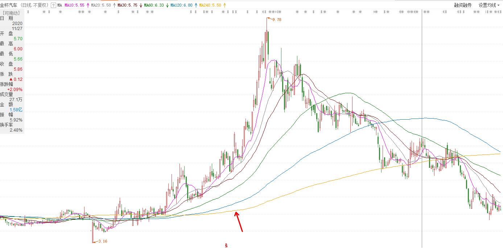

# 均线

均线是利用过去一段时间的**平均收盘价**计算得出的技术指标。计算公式：`MA = (C1+C2+C3+...+CN) / N`，例如10日均线，那么 N 就代表 10。

常用的均线包括5、10、30、60、120、250日均线等。下面是均线的影响力：

| K线数量 | 简称 | 周期 | 单K线影响力 | 寓意 | 本人日常应用 |
| :---: | :---: |  :---: |  :---: |  :---: |  :---: |
| 5 | 周线 | 短期 | 20.0% | 对短期情绪影响较大 | 新股、异动股止盈、减仓参考位 |
| 20 | 月线 | 短期 | 5.0% | 对中短期技术面影响较大 | 建仓、加仓、止盈、止损、减仓才考位 |
| 60 | 季线 | 中期 | 1.7% | 中期技术派常用生命线 | 建仓、加仓、止盈、止损、清仓才考位 |
| 120 | 半年线 | 中期 | 0.8% | 中长期趋势方向引导 | 通常突破后回踩建仓、加仓参考位 |
| 240 | 年线 | 长期 | 0.4% | 常用于 "牛、熊" 市判断 | 个人暂无具体应用 |

投资者可以根据自己的操作习惯，选择3~5条不同周期的移动平均线组合来辅助判断。例如，5-10-30日均线或者5-20-60-120-240日均线。

## 均线的基本用法

## 均线指标的应用方法

在实际操作中，投资者可以通过观察均线和K线的相对关系、不同均线间的相对关系还有均线和其它技术指标间的相对关系，来判断、预测未来行情。

上面这张图中，所有均线都上穿了 240 日均线，这个时候我们可以观察这只股票，并结合其它指标来确定买点。我们可以在红色箭头所指的地方建仓，当然也不是必须在这个地方建仓，根据你个人所学的知识来确定。

> 值得注意的是：我个人认为，买股票的时候，并不是一定要从最低点买进，最高点卖出。股票在上涨的时候，只要抓住一波就可以。
>
> 简单的来说，就是赚你自己能力以内的钱。

均线还是股价涨跌的重要支撑位和阻力位。当股价在均线上方时，如果下跌到均线位置获得支撑，就是看涨信号。当股价在均线下方时，如果上涨到均线位置遇到阻力，就是看跌信号。注意，这里说的是一个信号，当信号产生后具体买还是卖可也那个就要参考别的指标。

