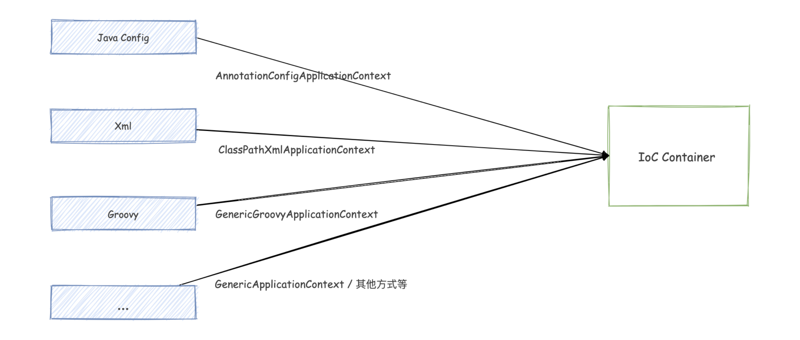
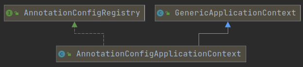

# 【Spring 源码分析】创建一个注解方式的容器


容器顾名思义就是用来存放东西的，例如一个水壶、水桶或水杯等都是一个容器。

但是 Spring 为什么会和容器产生关系呢？

要知道 Spring 框架虽然包含了很多个模块，但是最核心最基础的模块就是 IoC 容器。

**IOC 容器：**是具有依赖注入功能的容器，负责 **对象的实例化、对象的初始化，对象和对象之间依赖关系配置、对象的销毁、对外提供对象的查找** 等操作，对象的整个生命周期都是由容器来控制。

我们需要使用的对象都由 ioc 容器进行管理，不需要我们再去手动通过 `new` 的方式去创建对象，由 ioc 容器直接帮我们组装好，当我们需要使用的时候直接从 ioc 容器中直接获取就可以了。

所以简单的可以理解为 IoC 容器就是用来装对象的。

**Bean：**由 Spring 容器所管理的对象统称为 Bean 对象。Bean 就是普通的 Java 对象，和我们自己 `new` 的对象其实是一样的。


## 创建容器

Spring 在不同情况下可以创建不同的容器，这里创建的是关于注解的容器。

```java
AnnotationConfigApplicationContext context = new AnnotationConfigApplicationContext();
```

这是一个最简单的容器，当然这个容器中没有任何 Bean。

**那么 Spring IoC 容器是如何知道需要管理哪些对象呢？**

需要我们给 ioc 容器提供一个配置清单，可以通过 **xml 格式、java 注解或 API** 的方式创建配置清单，在配置文件中列出需要让 ioc 容器管理的对象，以及可以指定让 ioc 容器如何构建这些对象。

当 Spring 容器启动的时候，就会去加载这个配置文件，然后将这些对象给组装好以供外部访问者使用。

如果你想使用 **xml 配置文件** 来创建容器那么你可以使用 `ClassPathXmlApplicationContext` 或 `FileSystemXmlapplicationcontext`。

```java
// 从指定的文件系统路径下，查找 knight.xml 文件
ApplicationContext context = new FileSystemXmlApplicationContext("d:/knight.xml");

// 使用 ClassPathXmlApplicationContext 从应用的类路径下加载应用上下文
ApplicationContext context = new ClassPathXmlApplicationContext("knight.xml");
```


下图是创建 IoC 容器的几种方式：



还有两个是针对 Web 应用程序的：

- AnnotationConfigWebApplicationContext。
- XmlWebApplicationContext。


## 构造方法

```java
public AnnotationConfigApplicationContext() {
    this.reader = new AnnotatedBeanDefinitionReader(this);
    this.scanner = new ClassPathBeanDefinitionScanner(this);
}

public AnnotationConfigApplicationContext(DefaultListableBeanFactory beanFactory) {
    super(beanFactory);
    this.reader = new AnnotatedBeanDefinitionReader(this);
    this.scanner = new ClassPathBeanDefinitionScanner(this);
}

public AnnotationConfigApplicationContext(Class<?>... componentClasses) {
    this();
    register(componentClasses);
    refresh();
}

public AnnotationConfigApplicationContext(String... basePackages) {
    this();
    scan(basePackages);
    refresh();
}
```

通过构造方法三和构造方法四中的参数，我们就知道了有两种方式可以告诉 ioc 容器，来帮我们管理哪些对象。当然还可以通过该类中的 `register` 和 `scan` 方法来设置。

关于 [AnnotatedBeanDefinitionReader]()、[ClassPathBeanDefinitionScanner]()、[DefaultListableBeanFactory]() 可以查看相关文章。


## 方法

```java
// 对当前容器设置环境变量
@Override
public void setEnvironment(ConfigurableEnvironment environment) {
    super.setEnvironment(environment);
    this.reader.setEnvironment(environment);
    this.scanner.setEnvironment(environment);
}

// 指定 Bean 名称的生成策略
public void setBeanNameGenerator(BeanNameGenerator beanNameGenerator) {
    this.reader.setBeanNameGenerator(beanNameGenerator);
    this.scanner.setBeanNameGenerator(beanNameGenerator);
    getBeanFactory().registerSingleton(AnnotationConfigUtils.CONFIGURATION_BEAN_NAME_GENERATOR, beanNameGenerator);
}

// 处理 BeanDefinition 范围(作用域)，例如单例、多例等。
public void setScopeMetadataResolver(ScopeMetadataResolver scopeMetadataResolver) {
    this.reader.setScopeMetadataResolver(scopeMetadataResolver);
    this.scanner.setScopeMetadataResolver(scopeMetadataResolver);
}

// 注册一个 Bean
@Override
public <T> void registerBean(@Nullable String beanName, Class<T> beanClass,
	@Nullable Supplier<T> supplier, BeanDefinitionCustomizer... customizers) {

    this.reader.registerBean(beanClass, beanName, supplier, customizers);
}
```


## 拓展知识点 AnnotationConfigRegistry 接口

`AnnotationConfigRegistry` 接口可以理解为注解 Bean 的几种注册方式，可以使用包扫描和指定类的方式来注册 Bean。

```java
public interface AnnotationConfigRegistry {
    void register(Class<?>... componentClasses);
    void scan(String... basePackages);
}
```

拓展出这个知识点的原因是因为，`AnnotationConfigApplicationContext` 类实现了 `AnnotationConfigRegistry` 接口，下图是继承关系。

但是对于 `GenericApplicationContext` 类的源码分析可以看 [GenericApplicationContext 详解](2.[Spring 源码分析]GenericApplicationContext 详解)




## 问题

**Spring xml 文件中的 元素也可以使用注解，那么他们有什么不同的？**


## 总结

`AnnotationConfigApplicationContext` 是一个 Spring 容器。可以通过多个 `Class` 、包路径或者 `registerBean` 方法来创建 Bean。


## 参考文章

[Spring系列第2篇：控制反转（IoC）与依赖注入（DI），晦涩难懂么？](https://mp.weixin.qq.com/s?__biz=MzA5MTkxMDQ4MQ==&mid=2648933936&idx=1&sn=bd7fbbb66035ce95bc4fd11b8cb3bdf2)

[Spring容器基本使用及原理](https://mp.weixin.qq.com/s?__biz=MzA5MTkxMDQ4MQ==&mid=2648933940&idx=1&sn=6c8c6dc1d8f955663a9874c9f94de88e)

[Spring 容器--如何创建和加载一个 Spring 容器？](https://blog.csdn.net/tinyDolphin/article/details/75087551)


