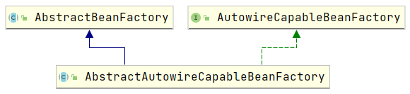

# 【Spring 源码分析】AbstractAutowireCapableBeanFactory 源码分析

在分析源码之前先来看一下 `AutowireCapableBeanFactory` 接口。

## 拓展知识点 AutowireCapableBeanFactory 接口

可以把这个接口亲切的理解为 “能自动连接的 Bean 工厂” 或者是 “能自动装配的 Bean 工厂”。

**自动连接(装配)谁？**

肯定值自动连接 Bean。

> 值得注意的是：这里是 BeanFactory 而不是 FactoryBean。

下图是继承关系：

1、对于想拥有自动装配能力，并且想要把这种能力暴露给外部应用的beanfactory需要实现该接口

2、正常情况下，不要实现该接口，应该实现BeanFactory或者ListableBeanFactory接口

3、需要注意的是ApplicationContext并没实现该接口。如果需要用到自动装配功能的话，可以调用ApplicationContext.getAutowireCapableBeanFactory()方法，来获取此接口实例。

4、如果一个接口实现了该接口，很大程度上，还要实现BeanFactoryWare接口，这样子就能在上下文中返回BeanFactory

